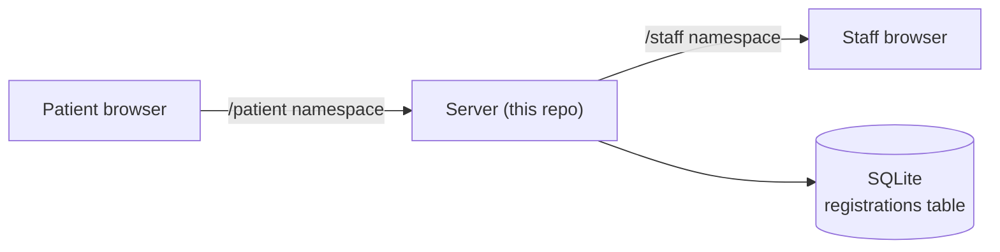
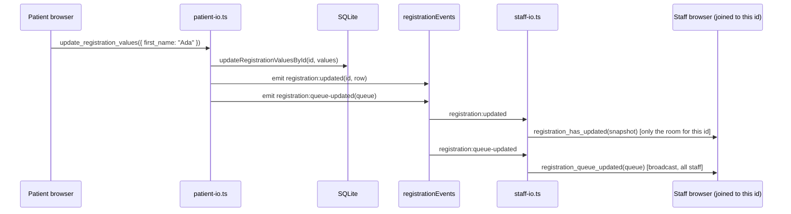
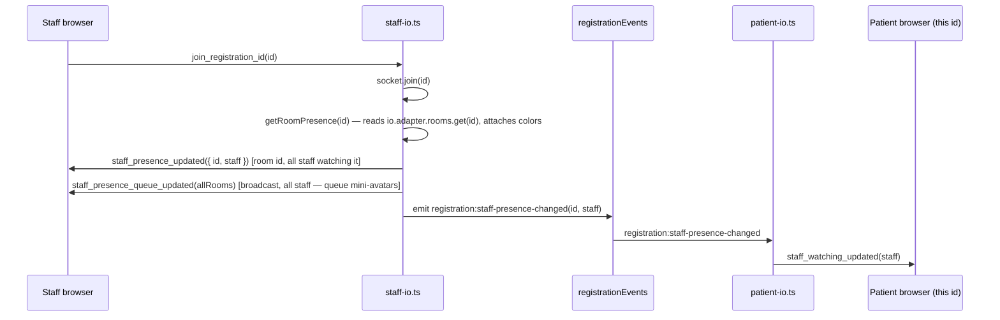
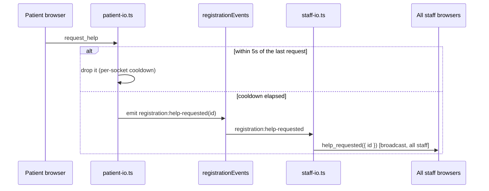

# Communication flow

How the patient app, staff app, and this server talk to each other. There are
**two socket.io namespaces** (`/patient`, `/staff`), **one internal event bus**
that connects them inside the server process, and **3 read-only REST routes**.
For exact event names and payloads, see [spec.md](spec.md).

## Namespaces at a glance

The patient and staff sides never talk to each other directly. The server sits
in between, backed by one SQLite table (`registrations`, see [db.ts](../src/db.ts)).

## Sequence: patient types into a field

`update_registration_errors` follows this exact same path — same
`noticeStaffForRegistrationChange` call, same `registration:updated` /
`registration_has_updated` events — the only difference is where the write
lands: [registration-errors.ts](../src/state/registration-errors.ts) (an
in-memory map) instead of the SQLite row. Both `values` and `errors` are
read back into the same `RegistrationSnapshot`, so a staff client never
needs to distinguish which of the two changed; it just gets the current
whole picture either way.

## Sequence: staff opens a registration (presence)

Staff presence flows the _opposite_ direction through the same event bus —
`staff-io.ts` owns it and tells `patient-io.ts` about it, instead of the
other way around. Room _membership_ isn't tracked separately — `socket.join`/
`socket.leave` already does that via socket.io's own room adapter;
[staff-presence.ts](../src/state/staff-presence.ts) only holds the color
assigned to each staff socket, looked up when reading a room back out.

Leaving a room (switching to another registration, or disconnecting) runs the
same broadcast after `socket.leave(id)` — see `staff-io.ts`'s
`join_registration_id`/`disconnect` handlers. When a registration is removed
entirely, `patient-io.ts` emits `registration:closed(id)` so `staff-io.ts` can
clear that room's presence instead of leaving it to linger forever.

## Sequence: patient asks for help

Unlike presence, this is broadcast to every staff socket regardless of which
room they've joined, so the queue list can flag the row even for a
registration no one is currently watching. The 5s cooldown is enforced here
(server-side, per socket) as a backstop — the client also disables its own
button for 5s, but this is what actually stops a spammed/scripted client.
